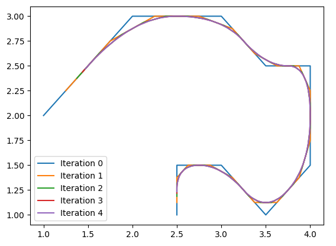

# Chaikin Smoothing

Provides smoothing of 2D coordinates (ie: GPS) using the Chaikin method as proposed here: 
[http://www.idav.ucdavis.edu/](http://www.idav.ucdavis.edu/education/CAGDNotes/Chaikins-Algorithm/Chaikins-Algorithm.html)


## Usage

```python
import chaikin

coordinates = [[1, 2], [2, 3], [3, 3], [3.5, 2.5]]
num_iterations = 3
smoothed_coordinates = chaikin.smooth(coordinates, n=num_iterations)
```

## Example




## Notes

- Does not deal with closed polygons
